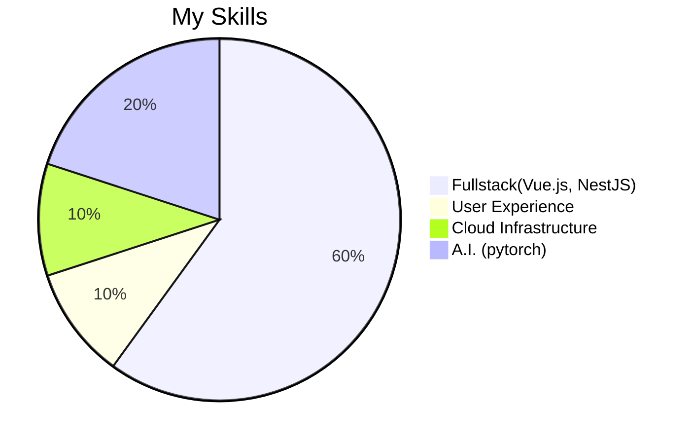

### Hi 👋, I'm Yicong (pronounced as 'ytson')

<!--
**Yc-Chen/Yc-Chen** is a ✨ _special_ ✨ repository because its `README.md` (this file) appears on your GitHub profile.

Here are some ideas to get you started:

- 🔭 I’m currently working on ...
- 🌱 I’m currently learning ...
- 👯 I’m looking to collaborate on ...
- 🤔 I’m looking for help with ...
- 💬 Ask me about ...
- 📫 How to reach me: ...
- 😄 Pronouns: ...
- ⚡ Fun fact: ...
-->

- 🔭 I’m currently working as Solution Architect at Philips in The Netherlands.
- 💬 Ask me about real world A.I.
- 🌱 I’m currently learning blockchain technologies.

My skills:

